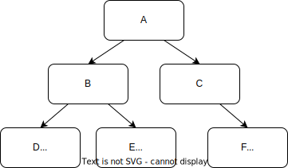

<style type="text/css">
ol { list-style-type: upper-alpha; }

blockquote {
  color: black;
  background: white;
  font-style: normal;
  font-size: inherit;
  border: 1px solid gray;
  background-color: lightyellow;
  padding: 1em;
}
</style>

<hr>

INSTRUCTIONS HERE ON HOW TO SUBMIT

<hr>

The [Boneh-Shoup book, Chapter 8.9](https://toc.cryptobook.us/book.pdf)
presents a formal treatment of Merkle trees and authenticated data
structures, if you would like a more detailed discussion of the ideas
behind this lab assignment.

In this lab assignment, you will attack an authenticated
key-value store that uses Merkle trees.  The code is available at
[https://github.com/mit-pdos/6.1600-labs/tree/main/merkle](https://github.com/mit-pdos/6.1600-labs/tree/main/merkle).

The key-value store consists of two parts: a _store_ that stores
key-value pairs, and a _client_ that can perform get and put operations.
The client can look up the current value of a key, or put a new value for
a particular key.  The client doesn't store the key-value pairs itself,
and relies on the store for that purpose.  Importantly for this lab,
though, the client tries to ensure that the store is behaving correctly,
using a Merkle tree.


# Warm-up exercises

To get familiar with the key-value store used in this lab, experiment
with it using the command-line interface.  Run `make venv` to set up
the Python environment with the required packages.  Then, start the store
server by running `make run-server`.  Finally, in another terminal, use
`venv/bin/python cli.py` to issue put and get requrests to the server, like:

```
    % venv/bin/python cli.py get foo
    % venv/bin/python cli.py get hello
    % venv/bin/python cli.py put foo bar
    % venv/bin/python cli.py put hello world
    % venv/bin/python cli.py get foo
    % venv/bin/python cli.py get hello
    ...
```

Answer the following questions:

1. When you restart the server (kill the running server and run
  `make run-server` again), what happens to subsequent client lookups
  (get operations)?  How does the client know that the server restarted?

    _Hint:_ if you get the client and server in an inconsistent state after
  restarting the server, you can use `python cli.py reset` to get yourself
  back to a clean starting state again.

2. Why do subsequent client updates (put operations) fail to execute
  after a server restart?  What would go wrong if they didn't fail?


# Merkle tree implementation

For the rest of this lab assignment, you will need to understand the
exact way in which our code authenticates key-value operations.
The way the client authenticates the store's responses is by constructing
a tree of the current key-value mappings, and building a Merkle hash tree
for that key-value tree.  An example Merkle tree is shown in this figure:



You can see the code for this construction in
[common.py](https://github.com/mit-pdos/6.1600-labs/blob/main/merkle/common.py).
`A` is the root of the tree in the example diagram.  Each subtree (including
the leaf nodes at the bottom, the intermediate nodes in the tree, and the root
node) is represented by some byte string:

- A leaf node with a single key-value pair, such as the `D`, `E`, and `F` nodes,
  is represented by `H_kv()` (the hash of the concatenation of the key and the
  value, such as the concatenation of `foo` and `bar` for the `D` node).

- An intermediate tree node is represented by `H_internal()` (the hash of the
  concatenation of the left and right subtree representations).
  For instance, the `B` node is represented by the hash of the concatenation
  of the hashes for `D` and `E`, in that order, and `A` is the hash of
  the concatenation of the hashes for `B` and `C`.

- An empty subtree is represented by `H_empty()` (an empty string).
  This shows up in cases when an internal node has only one child (e.g.,
  `C` has only a right child, so its left child is the empty subtree,
  represented by `H_empty()`).  A tree containing no elements has an
  empty root, so the root (and thus the entire tree) would be represented
  by `H_empty()`.

The client stores the root value, and uses that to authenticate all
operations on the tree.

To find a given key-value pair, the client traverses the tree going
left and right based on the hash of the key that it wants to find,
`traversal_path(key)`, which is the hash of the `key`.  That is,
each key has a specific place where it can be found in the tree.
However, a tree does not need to be expanded all the way to the depth of
`traversal_path()`, if there aren't other keys with similar prefixes of
their `traversal_path()`.  In our example tree diagram above, the high
bit in the hash of `foo` and `baz` are both `0`, so they are both on the
left side of the root.  The next-highest bit in the hash of `foo` is `0`
and the same bit in the hash of `baz` is `1`, which is why `foo` is on
the left of node `B`, and `baz` is on the right.  The high two bits of
the hash of `abc` are both `1`, which is why it's on the right side.
There is no requirement for the tree to be in a minimal shape; for
instance, the key-value pair for `abc` could have appeared in the `C`
node, without expanding the tree down one more level.

You can use the `--print-proofs` command to ask the client to explicitly
print out the steps of proof verification, to help understand how the
client authenticates the responses it gets from the store.  For example:

```
    % venv/bin/python cli.py reset
    % venv/bin/python cli.py put foo bar
    % venv/bin/python cli.py put hello world
    % venv/bin/python cli.py --print-proofs get foo
```

Answer the following questions:

{:start="3"}
1. How long is the proof for `get foo` after you've inserted both
  `foo=bar` and `hello=world` into the store, as in the above example?
  Explain why that is.


# Attack scenario 1: Key-value confusion

For this and subsequent attack assignments, your job will be
to find weaknesses in this authentication scheme.  You can look at
[client.py](https://github.com/mit-pdos/6.1600-labs/blob/main/merkle/client.py)
and
[store.py](https://github.com/mit-pdos/6.1600-labs/blob/main/merkle/store.py)
to understand how these two components work in detail.

1. Find a weakness in the authentication scheme that allows an adversarial
  store to produce a fake key-value pair that will appear to be valid to a client
  (i.e., get succeeds), after the client inserts just one valid key-value pair of
  its own choice (`hello`, `world`).

   We formalize this attack scenario in the code of `scenario_one()` in
   [grader.py](https://github.com/mit-pdos/6.1600-labs/blob/main/merkle/grader.py).
   The client inserts a key-value pair (`hello`, `world`), and then the client
   starts interacting with the adversarial store (`c._store = a`), and the adversary
   gets to supply a fake key of the adversary's choice (`a.attack_fake_key()`).

2. Implement your attack by modifying `AttackOne` in
  [attack.py](https://github.com/mit-pdos/6.1600-labs/blob/main/merkle/attack.py).
  Run `make check` to check if your attack works.


# Attack scenario 2: Many fake key-value pairs

Consider the scenario in `scenario_two()` of
[grader.py](https://github.com/mit-pdos/6.1600-labs/blob/main/merkle/grader.py):
the client inserts a single key-value pair of the adversary's choice
(`a.attack_key_value()`), and the adversary's job is to make it so that
many key-value lookups will then succeed on the client (all of the keys in
`a.attack_fake_keys()` must appear to exist).

1. Find a weakness in the authentication scheme that allows an adversary to
  mount an attack against scenario 2.

2. Implement your attack by modifying `AttackTwo` in
  [attack.py](https://github.com/mit-pdos/6.1600-labs/blob/main/merkle/attack.py).
  Run `make check` to check if your attack works.


# Attack scenario 3: Fake proofs

Consider the scenario in `scenario_three()` of
[grader.py](https://github.com/mit-pdos/6.1600-labs/blob/main/merkle/grader.py):
the grader inserts many keys, `k0` through `k999`, into the store.
Your job, in `AttackThree`, is to create fake proofs that convince the
client that all of those keys are missing (i.e., `lookup()` should return
`None`).  To make this attack slightly more challenging, and to also
prepare you for the next attack, you must construct fake proofs with a
single element in the `proof.siblings` list.

1. Find a weakness in the authentication scheme that allows an adversary to
  mount an attack against scenario 3.

2. Implement your attack by modifying `AttackThree` in
  [attack.py](https://github.com/mit-pdos/6.1600-labs/blob/main/merkle/attack.py).
  Run `make check` to check if your attack works.


# Attack scenario 4: Insert confusion

Consider the scenario in `scenario_four()` of
[grader.py](https://github.com/mit-pdos/6.1600-labs/blob/main/merkle/grader.py):
the client inserts 1000 short key-value pairs of the client's choice,
while interacting with the adversary's store.  (Previously all of
the client inserts took place against the real key-value store.)
The client then gets a key from the adversary, which should appear to
exist (get succeeds), and the resulting key-value pair should be long
(over 1000 bytes).

It might be helpful to understand how the client checks proofs when doing
an insert.  Use `cli.py` to experiment with this; for example:

```
    % venv/bin/python cli.py reset
    % venv/bin/python cli.py --print-proofs put foo bar
    % venv/bin/python cli.py --print-proofs put hello world
    % venv/bin/python cli.py --print-proofs get hello

    % venv/bin/python cli.py --print-proofs put abc def
    % venv/bin/python cli.py --print-proofs get abc
```

What proof is being presented for each `put` operation?  How does the
proof presented for `put hello world` compare with the proof presented for
`get hello`?  What about for `abc`?  You don't have to submit answers
to these questions, but understanding how this works will likely help
you implement the attack for scenario 4.

1. Find a weakness in the authentication scheme that allows an adversary to
  mount an attack against scenario 4.

2. Implement your attack by modifying `AttackThree` in
  [attack.py](https://github.com/mit-pdos/6.1600-labs/blob/main/merkle/attack.py).
  Run `make check` to check if your attack works.


# Fixing the security definition and the implementation

Here is a starting point for a security definition for the authenticated
key-value store:

> Suppose that a client performs some set of key-value puts.
> The client is secure if, when it performs a subsequent get
> of any value against a store controlled by a computationally-bounded adversary,
> it will either return the same result that it would have gotten from the
> correct store, or raise an exception.

1. Extend this definition to capture the attack scenarios codified
   in `grader.py` in the three attacks above, to arrive at a strong
   definition of security for an authenticated key-value store.

2. How would you change the implementation to ensure security against all
   of the attacks in your revised definition?  There are multiple correct
   ways to make the Merkle tree secure; you only need to describe one.
